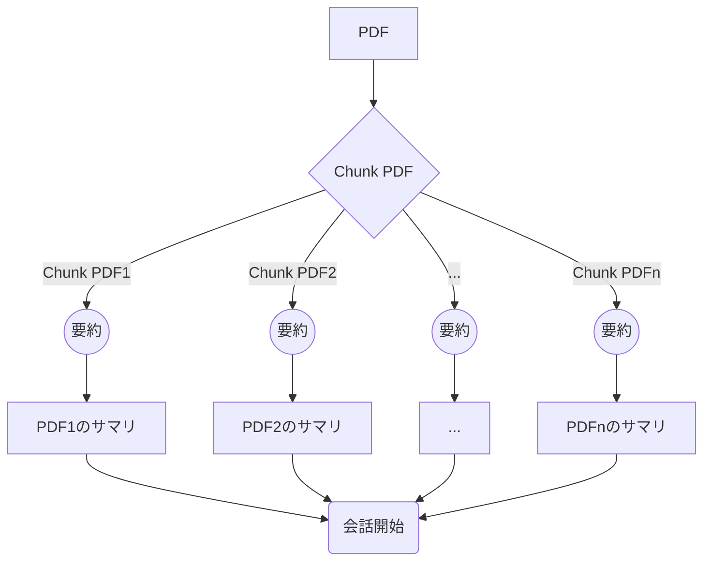

## USER
あなたはプロのエンジニアです。下記にブログタイトルと、ブログの素案を渡します。下記の情報からブログ執筆にあたって足りない部分を指摘してください。

タイトル: **AIとペアプロ！GPT-4と協力してPDF要約＆質問応答サービスの作った話"**

素案:

- 概要
    - 動画を乗せる
    - pdfを読み込み、要約が提供された後会話が開始できるサービスです。
    - 自分は隔週で勉強会で論文紹介をしているのでこれをラクにしたい、つまり自分で使いたいと思えるサービスを作った
- 説明
    - 使用技術
        - PyPDF
        - streamlitとopenai-api
    - 文章を一定のサイズに区切り(チャンクと呼ぶ)、それぞれチャンクの内容を翻訳してというプロンプトで繰り返しGPTに司令します。
    - 上記の司令が終了したら、その会話の続きとして会話を続けられるようにチャットが開く
- 使い方
    - Readmeに書いてあるとおりですが
    - git clone → docker-compose up → localhostにアクセス → API_KEYを入力で利用可能です。
- プロダクトの作り方
    - まずブレインストーミングをGPT4として、開発方針をを決めた
        - マイルストーンを作ってもらい、どんな技術や手順が必要化を把握した
    - プロトタイプを作ってもらった
        - 環境のセットアップ
            - Dockerfile, やレポジトリの開発
    - 途中から無理だったので自分で読んでやった
        - streamlitの新しい機能を使った開発
- ChatGPTが得意なこと・任せてよかったところ
    - ブレインストーミング
    - 利用人口が多い技術に関する質問
        - Docker-composeやプロダクト開発のノウハウ、Webアプリのディレクトリ構造などは正確に教えてくれた
    - 入力情報を考慮した、出力形式の変換
        - readmeの作成
        - シーケンス図の作成
- ChatGPTが苦手なこと
    - 最新ライブラリに関する開発方針
    - ディレクトリ構造・他のコードとの相互作用を考慮したバグの修正
        - これは今のChatGPTのインターフェースや会話の記憶量によるところが大きい
- 今後の開発はどうなるか
    - ChatGPTは会話特化
        - なにかに特別にアラインしたモデルが出ればもっと良くなる
    - 自分は、新しい技術に触りつつ、アイディアも考えていきたい
    - プロトタイプの作成コストは確実に下がる
        - ユーザへの価値検証やPMFの作成は議論するより、コードを書くフェーズになりそ
            - トレードオフのweightがずれたので、適切な手法も変わってきそう
    - 開発初期や、チームメンバーへの共有の手間数が確実に下る
- 次作るならどうするか
    - もう少し要件を決めてから投げたい
- 参考資料
    - [https://zenn.dev/kentarok/articles/5e326b627c1b2c](https://zenn.dev/kentarok/articles/5e326b627c1b2c) Please continue

## ASSISTANT
素案にはいくつかの重要な情報が含まれていますが、以下の点が不足していると考えられます。

1. ブログのイントロダクション
    - サービスの背景や目的について簡潔に説明することで、読者に興味を持ってもらいやすくなります。

2. PyPDFとstreamlit、openai-apiの詳細
    - 使用技術について、それぞれのライブラリやAPIがどのような役割を果たしているのか、具体的な説明が必要です。

3. 要約アルゴリズムの説明
    - サービスがどのようにしてPDF文書を要約しているのか、アルゴリズムや手法について詳しく説明することが重要です。

4. 質問応答機能の説明
    - 質問応答機能の仕組みや、ユーザーがどのような質問を投げかけることができるのかについて説明が必要です。

5. セキュリティやプライバシーに関する考慮事項
    - ユーザーがアップロードするPDFファイルやAPIキーに関するセキュリティやプライバシーの対策について言及することが望ましいです。

6. チャレンジや反省点
    - プロジェクトの過程で遭遇した問題や難しさ、そしてその解決策や反省点について共有することで、他の開発者に有益な情報を提供できます。

7. スクリーンショットや図解
    - サービスの操作画面やシステム構成図などのスクリーンショットや図解を用意し、説明を視覚的に補足することが効果的です。

これらの足りない部分を追加することで、ブログの内容が充実し、読者にとって理解しやすくなります。

## USER
ブログのイントロダクションを書いてください

## ASSISTANT
ブログイントロダクション:

本記事では、AI技術を活用してPDF文書を要約し、質問応答サービスを提供するWebアプリケーションの開発プロセスについて解説します。このサービスは、研究者や学生が論文を効率的に理解するための支援ツールとして設計されており、GPT-4を利用して質の高い要約と質問応答が可能です。開発にはPyPDF、streamlit、openai-apiなどの技術が活用されています。本記事では、開発の背景や目的から、使用技術の詳細、実装の課題や解決策、そして今後の展望について詳しく説明していきます。このサービスの開発過程を通じて、AI技術とエンジニアが協力して新しい価値を創出する方法についての知見を共有することを目指しています。

## USER
もう少し柔らかい

## ASSISTANT
ブログイントロダクション（柔ら

## USER
もう少し柔らかい

## ASSISTANT
ブログイントロダクション（柔らか

## USER
もう少し柔らかい表現のイントロダクションにしてください。内容はそのままで、下記のような文調にしてください。

“こんにちは、Wantedlyでデータサイエンティストをしている[樋口](https://www.wantedly.com/id/kokoroo)です!

自分は過去、分析のためにSQLを書いているとき、以下のようなミスをしていました。

- メール開封率を集計したら**何故か100%を超えてしまった。でもどこが原因かがわからない**
- メール開封率を集計したのち、クリック率も追加で依頼を受けたが、**再利用できるクエリになっておらず、一から書き直した**
- クエリのレビューを依頼したら、**複雑すぎる**と言われてしまった

こういった経験がある方は自分以外にもいるのではないでしょうか...! SQLは非常に自由度が高く便利である反面、書き方が個人に委ねられ、複雑・難解になりやすいと感じています。

そこで本記事では、自分が実務で学んだ、**読みやすく、再利用しやすいSQLクエリの書くコツ**を紹介したいと思います。個人の経験によるものなので、より良い書き方・考え方もあるかもしれないです。ご了承ください🙏” Please continue

## ASSISTANT
ブログイントロダクション（柔らかい表現）:

こんにちは！今回は、AI技術を使ってPDF文書を要約し、質問応答サービスを提供するWebアプリケーションを開発した話をお届けしたいと思います。このサービスは、論文を読む際に役立つサポートツールとして作成しました。GPT-4を使って、手軽に要約と質問応答ができるんですよ！

開発には、PyPDF、streamlit、openai-apiといった技術を駆使しました。記事では、開発のきっかけや目的から、どのようにしてこれらの技術を活用したのか、実際の開発でどんな困難に直面し、どうやって解決していったのかなど、興味深い話をシェアします。

このサービス開発を通じて、AI技術とエンジニアがどのように協力し、新たな価値を生み出すことができるのか、そんな知見をみなさんと共有できたら嬉しいです。ぜひ最後までお付き合いくださいね！

## USER
**[gpt-pdf-summarizer](https://github.com/zerebom/gpt-pdf-summarizer)**の概要の章を書いてください。出力はMarkdonwのコードスニペットのみでお願いします。

- gpt-pdf-sumarrizerの概要
    - ”demo動画を乗せる”
    - pdfを読み込み、要約が提供された後会話が開始できるサービスです。
    - 自分は隔週で勉強会で論文紹介をしているのでこれをラクにしたい。つまり自分で使いたいと思えるサービスを作りました

## ASSISTANT
```markdown
## gpt-pdf-summarizerの概要


gpt-pdf-summarizerは、PDF文書を読み込み、要約を提供した後に会話が開始できるサービスです。これにより、論文を効率的に理解し、さらに疑問点についてもAIと対話を行うことが可能となります。私自身、隔週で勉強会で論文紹介を行っており、そのプロセスを効率化したいと感じていました。そこで、自分自身が使いたいと思えるようなサービスを開発しました。
```


## USER
同様に実装内容の章を書いてください

- **[gpt-pdf-summarizer](https://github.com/zerebom/gpt-pdf-summarizer)**の実装内容
    - 使用技術
        - PyPDF
        - streamlit
        - FastAPI
        - openai-api
    - 中身は凄くシンプルで、文章を一定のサイズに区切り(チャンクと呼ぶ)、それぞれチャンクの内容を翻訳してというプロンプトで繰り返しGPTに司令するようにしています。
    - 上記の司令が終了したら、その会話の続きとして会話を続けられるようにチャットが開きます
    - 図にすると下記の通り

        ```
        graph TD;
            A[PDF] --> B{Chunk PDF};
            B --> |Chunk PDF1| C((要約));
            B --> |Chunk PDF2| D((要約));
            B --> |...| E((要約));
            B --> |Chunk PDFn| F((要約));
            C --> G[PDF1のサマリ];
            D --> H[PDF2のサマリ];
            E --> I[...];
            F --> J[PDFnのサマリ];
            G --> K(会話開始);
            H --> K;
            I --> K;
            J --> K;

        ```

## ASSISTANT
```markdown
## gpt-pdf-summarizerの実装内容

### 使用技術
- PyPDF
- streamlit
- FastAPI
- openai-api

実装内容は非常にシンプルです。まず、文章を一定のサイズに区切り（チャンクと呼ぶ）、それぞれのチャンクの内容を翻訳するプロンプトを用いて、GPTに繰り返し命令を送ります。これにより、各チャンクごとに要約を生成することができます。

すべてのチャンクの要約が完了したら、その会話の続きとして会話ができるようにチャットが開きます。

以下の図で実装内容を表しています。


```

## USER
使い方の章も同様にお願いします
- **[gpt-pdf-summarizer](https://github.com/zerebom/gpt-pdf-summarizer)**の使い方
    - Readmeに書いてあるとおりですが
    - git clone → docker-compose up → localhostにアクセス → API_KEYを入力で利用可能です。

## ASSISTANT
```markdown
## gpt-pdf-summarizerの使い方

gpt-pdf-summarizerの使い方はReadmeに記載されていますが、ここでも手順を簡単に紹介します。

1. リポジトリをクローンします: `git clone https://github.com/zerebom/gpt-pdf-summarizer.git`
2. ディレクトリに移動し、`docker-compose up`を実行します。
3. ブラウザで`localhost`にアクセスします。
4. APIキーを入力してサービスを利用できます。

以上の手順で、gpt-pdf-summarizerを簡単に使い始めることができます。
```

## USER
次の章も書いてください。追記したほうが良い所があれば追記し、なぜそうしたかを教えて下さい
- プロダクトの作り方
    - まずブレインストーミングをGPT4として、開発方針をを決めた
        - マイルストーンを作ってもらい、どんな技術や手順が必要化を把握した
    - GPT4にプロトタイプを作ってもらった
        - 環境のセットアップ
            - Dockerfile, やレポジトリの開発
        - PDFを読み込むにはどういうライブラリを使えばよいか、なども知らなかったのでこれを提供してくれたのは便利だった
    - 開発途中から出力されるコードが不正確になってきたので、自分で読んで実装した
        - 開発が進むごとに、提供されるコードでは正常に動かなくなったので、streamlit周りは結局ドキュメントを読んで手動で実装しました。
        - 動作しない例
            - 提供してくれるライブラリのバージョンが古く、正常に動作しない
            - 実装が増えるごとに、他のコードとの整合性の合わないコードが提供される
        - streamlitの新しい機能を使った開発

## ASSISTANT
```markdown
## プロダクトの作り方

gpt-pdf-summarizerの開発プロセスは以下の通りです。

1. まず、GPT-4とブレインストーミングを行い、開発方針を決定しました。
    - GPT-4にマイルストーンを作成してもらい、必要な技術や手順を把握しました。
2. GPT-4にプロトタイプの開発を依頼しました。
    - 環境のセットアップ
        - Dockerfileやリポジトリの開発
    - PDFを読み込むために使用するライブラリなど、知らなかった情報も提供してもらいました。
3. 開発途中でGPT-4から提供されるコードが不正確になってきたため、自分でコードを読み込んで実装しました。
    - 開発が進むごとに、提供されるコードが正常に動作しなくなることがありました。そのため、Streamlit周りはドキュメントを読み、手動で実装しました。
    - 動作しない例：
        - 提供されるライブラリのバージョンが古く、正常に動作しない場合
        - 実装が増えるごとに、他のコードとの整合性が取れないコードが提供される場合
    - この問題を解決するために、Streamlitの新しい機能を使用して開発を進めました。

開発プロセスを通じて、GPT-4と協力しながらプロダクトを作ることができました。しかし、開発が進むにつれて、GPT-4から提供されるコードの正確さに問題が生じました。このため、一部の実装は自分で行う必要がありました。今後の開発では、GPT-4との連携をさらに改善し、より効率的なプロダクト開発ができるようになることを目指しています。
```

## USER
なるべく、箇条書きを使わずに書き直してください

## ASSISTANT
## プロダクトの作り方

gpt-pdf-summarizerの開発プロセスは、最初にGPT-4とブレインストーミングを行い、開発方針を決定しました。GPT-4にマイルストーンを作成してもらい、必要な技術や手順を把握しました。その後、GPT-4にプロトタイプの開発を依頼し、環境のセットアップやPDFを読み込むために使用するライブラリなど、知らなかった情報も提供してもらいました。

しかし、開発途中でGPT-4から提供されるコードが不正確になってきたため、自分でコードを読み込んで実装しました。開発が進むごとに、提供されるコードが正常に動作しなくなることがありました。そのため、Streamlit周りはドキュメントを読み、手動で実装しました。例えば、提供されるライブラリのバージョンが古く、正常に動作しない場合や、実装が増えるごとに、他のコードとの整合性が取れないコードが提供される場合がありました。この問題を解決するために、Streamlitの新しい機能を使用して開発を進めました。

開発プロセスを通じて、GPT-4と協力しながらプロダクトを作ることができました。しかし、開発が進むにつれて、GPT-4から提供されるコードの正確さに問題が生じました。このため、一部の実装は自分で行う必要がありました。今後の開発では、GPT-4との連携をさらに改善し、より効率的なプロダクト開発ができるようになることを目指しています。

## USER
前後の文脈を加味して、同様に得意なこと・任せてよかったところの章を書いてください

- ChatGPTが得意なこと・任せてよかったところ
    - ブレインストーミング
        - マネタイズ方法やマイルストーンの置き方なども参考になった
    - 利用人口が多い技術に関する質問
        - Docker-composeやプロダクト開発のノウハウ、Webアプリのディレクトリ構造などは正確に教えてくれた
        - また、同様のディレクトリ構成を作成するshell scriptの作成など便利だった
    - 入力情報を考慮した、出力形式の変換
        - これまでの会話をもとにドキュメント作成してくれる
            - readmeの作成
        - また、ChatGPTが今実装をどういう風に理解してるか、を確認するために、シーケンス図の作成をするのも良かった。
            - 自分の頭の整理にもなった

## ASSISTANT
## ChatGPTの得意なこと・任せてよかったところ

ChatGPTは、プロジェクトの様々な段階で役立つことがありました。特に得意なことや、任せて良かった点は以下の通りです。

1. **ブレインストーミング**: ChatGPTは、ブレインストーミングの際に有益なアイデアを提案してくれました。マネタイズ方法やマイルストーンの設定など、具体的なアドバイスが参考になりました。
2. **利用人口が多い技術に関する質問**: Docker-composeやプロダクト開発のノウハウ、Webアプリのディレクトリ構造など、多くの人が利用している技術に関する質問に対して、ChatGPTは正確な回答を提供してくれました。また、便利なシェルスクリプトの作成などもサポートしてくれました。
3. **入力情報を考慮した出力形式の変換**: ChatGPTは、これまでの会話をもとにドキュメントを作成してくれる能力があります。例えば、READMEの作成などで役立ちました。また、ChatGPTがどのように実装を理解しているかを確認するために、シーケンス図の作成を依頼することもできました。これは、自分の頭の整理にも役立ちました。

このように、ChatGPTはプロジェクトのいくつかの側面で助けとなりました。特にブレインストーミングや一般的な技術に関する質問、そして入力情報に基づいた出力形式の変換が得意であることが分かりました。今後もChatGPTのこれらの能力を活用して、効率的なプロダクト開発を進めていくことが期待できます。

## USER
前後の文脈を加味して、下記の章も書いてください。また、情報を想像して足しても構いません
- ChatGPTが苦手なこと
    - 最新ライブラリに関する開発方針
    - ディレクトリ構造・他のコードとの相互作用を考慮したバグの修正
        - これは今のChatGPTのインターフェースや会話の記憶量によるところが大きい
    - 自分が要件定義できてないコードは構造化できない

## ASSISTANT
## ChatGPTの苦手なこと

ChatGPTは多くの点で役立ちますが、苦手な部分も存在します。以下に、そのような例を挙げています。

1. **最新ライブラリに関する開発方針**: ChatGPTは、最新のライブラリに関する開発方針やベストプラクティスについては十分に把握していないことがあります。これは、トレーニングデータが一定時点までのものであるため、最新の情報が含まれていないことが原因です。
2. **ディレクトリ構造・他のコードとの相互作用を考慮したバグの修正**: ChatGPTは、ディレクトリ構造や他のコードとの相互作用を考慮したバグ修正に苦戦することがあります。これは、現在のChatGPTのインターフェースや会話の記憶量による制約が大きいためです。したがって、コードの全体像を把握しながらバグ修正を行う際は、開発者自身が手を加える必要があります。
3. **自分が要件定義できていないコードの構造化**: ChatGPTは、明確な要件定義がない場合にコードを効果的に構造化することが難しいことがあります。これは、ChatGPTが開発者の意図や背景情報を完全に理解することができないためです。そのため、明確な要件定義を与えることが、ChatGPTと効果的に協力してプロジェクトを進めるための鍵となります。

これらの苦手な点を考慮しながら、ChatGPTを効果的に活用することが重要です。最新のライブラリやバグ修正に関しては、開発者自身がドキュメントを参照し、要件定義については明確に伝えることで、ChatGPTとの協力をよりスムーズに進めることができます。

## USER
前後の文脈を加味して、下記の章も書いてください。また、情報を想像して足したり、文章を修正してもも構いません
- 今後の開発フローはどうなるか
    - ChatGPTは会話特化なモデルに過ぎない
        - なにかに特別にアラインしたモデルが出ればもっと良くなる
        - 例えばCopilot Xなど実装に特化した学習とインターフェースが提供されれば更に実装効率は飛躍的に上がるはず
    - プロトタイプの作成コストは確実に下がる
        - ユーザへの価値検証やMVPの作成は議論するより、コードを書いて動くもので検証するかも
            - トレードオフのweightがずれたので、適切な手法も変わってきそう
    - 開発初期や、チームメンバーへの共有の手間数は確実に下る

## ASSISTANT
## 今後の開発フローの変化

ChatGPTをはじめとするAI技術の進歩によって、開発フローはさまざまな面で変化するでしょう。以下に、そのような変化の可能性を挙げています。

1. **特化型AIモデルの登場**: 現在のChatGPTは会話に特化したモデルであり、他の特定の分野に強いモデルが登場することで、開発効率が飛躍的に向上する可能性があります。例えば、Copilot Xのような実装に特化した学習とインターフェースが提供されれば、開発者がさらに効率的にコードを書くことができるでしょう。

2. **プロトタイプ作成コストの低減**: AI技術の進歩により、プロトタイプの作成コストが確実に下がります。ユーザーへの価値検証やMVPの作成は、議論するよりも、AIを活用して実際に動くコードを書いて検証することが一般的になるかもしれません。その結果、プロジェクトの進行速度や柔軟性が向上することが期待されます。

3. **開発初期やチームメンバーへの共有の効率化**: AI技術の活用により、開発初期のコード構築やチームメンバー間での情報共有の効率が向上します。AIが簡単にコードや設計ドキュメントを生成できるようになることで、開発者は手間を削減し、より創造的なタスクに集中できるようになるでしょう。

これらの変化を受けて、開発フローは新たな形に進化し、開発者とAIが協力してプロジェクトを推進する新しいスタイルが確立されることが期待されます。最適な手法も変わってくるため、AI技術の進歩に合わせて開発者が適応し、効果的な開発フローを確立していくことが重要です。

## USER
前後の文脈を加味して、下記の章も書いてください。また、情報を想像して足したり、文章を修正してもも構いません


- 次作るならどうするか
    - もう少し要件を決めてからGPTに質問していきたい投げたい
        - こちらの要件が不十分だったときに、微妙なアウトプットを微調整させて意図したものにするのは難しい
            - GPTが前後の会話を引っ張りすぎてしまうので
        - なるべく曖昧性の低い質問を最初にしたほうが良いアウトプットができるイメージ
            - どういうプロンプトにするか、はそれこそGPTと会話して作っても良い
    - 自分の役職でない人のPjMやPdM, UXデザイナーの役割などをもたせたら、自分の知らない能力を拡張できるかも
        - 例えば会話を複数に分けて、エンジニア、デザイナー、PdM等の振る舞いをさせてみる

## ASSISTANT
## 次にプロジェクトを開始する際の改善点

次のプロジェクトを開始する際には、以下のような改善点を考慮することで、より効果的にGPTを活用できるでしょう。

1. **要件の明確化**: GPTに質問を投げる前に、要件をより具体的に決めておくことが重要です。曖昧な要件では、GPTから得られるアウトプットも微妙であり、意図したものに調整することが難しくなります。そのため、曖昧性の低い質問を最初にすることで、より良いアウトプットが得られることが期待できます。また、適切なプロンプトの設定も、GPTとの会話を通じて作成することができます。

2. **異なる役割を持たせる**: GPTを活用して、プロジェクトマネージャーやプロダクトマネージャー、UXデザイナーなどの異なる役割を持たせることで、自分の知らない能力を拡張できる可能性があります。具体的には、会話を複数に分けて、それぞれの役割に応じた振る舞いをGPTにさせることで、多様な視点からのアドバイスや提案を得ることができます。

これらの改善点を取り入れることで、次回のプロジェクトではより効果的にGPTを活用し、開発効率や成果物の質を向上させることができるでしょう。AI技術の進歩に伴って、開発者が適切な方法でAIと協力することが、プロジェクト成功への鍵となります。

## USER
自分の内省としての、改善点なのでそのようなことがわかるような文章にしてほしいです

## ASSISTANT
## 自分自身の内省としての改善点

次のプロジェクトを開始する際に、私自身がGPTとの協力をより効果的に行うための改善点を以下のように考えています。

1. **要件の明確化**: GPTに質問を投げる前に、私自身が要件をより具体的に決めておくべきだと感じました。曖昧な要件では、GPTから得られるアウトプットも微妙であり、意図したものに調整することが難しくなります。そのため、曖昧性の低い質問を最初にすることで、より良いアウトプットが得られることが期待できます。また、適切なプロンプトの設定も、GPTとの会話を通じて作成することができます。

2. **異なる役割を持たせる**: GPTを活用して、プロジェクトマネージャーやプロダクトマネージャー、UXデザイナーなどの異なる役割を持たせることで、私自身の知らない能力を拡張できる可能性があります。具体的には、会話を複数に分けて、それぞれの役割に応じた振る舞いをGPTにさせることで、多様な視点からのアドバイスや提案を得ることができます。

これらの改善点を取り入れることで、次回のプロジェクトでは私自身がGPTとの協力をより効果的に行い、開発効率や成果物の質を向上させることができるでしょう。AI技術の進歩に伴って、開発者が適切な方法でAIと協力することが、プロジェクト成功への鍵となります。この経験を通して、私は自分の開発プロセスを見直し、改善することが重要だと学びました。

## USER
では、最後に締めくくりの章を作ってください

## ASSISTANT
## まとめと展望

私たちは、GPT-4を活用した開発プロセスを通じて、AIと協力してプロジェクトを進める新しい方法を試みました。この経験から得られた教訓と改善点を活かすことで、今後のプロジェクトではさらなる効率化と成果物の質の向上が期待できます。

GPT-4のようなAI技術は、私たちの開発プロセスを革新的に変える力を持っていますが、その一方で、適切な方法で活用することがプロジェクトの成功に繋がります。今回のプロジェクトで得られた教訓をもとに、要件定義の明確化や、GPTに異なる役割を持たせることで、私たちがAIとより効果的に協力する方法を模索していくことが重要です。

また、今後はより特化したAIモデルやインターフェースが登場することで、開発効率が飛躍的に向上する可能性があります。これらの技術を活用することで、プロトタイプの作成コストやチームメンバーへの共有の手間が大幅に削減されることが期待されます。

最後に、GPT-4との協力を通じて、私たちは自分自身の開発プロセスを見直し、改善する機会を得ました。これからも、技術の進歩を取り入れつつ、自分たちの開発プロセスを磨き続けることが、プロジェクトの成功に繋がるでしょう。私たちは、AI技術と協力しながら、より良いプロダクトを開発していく未来に期待しています。
